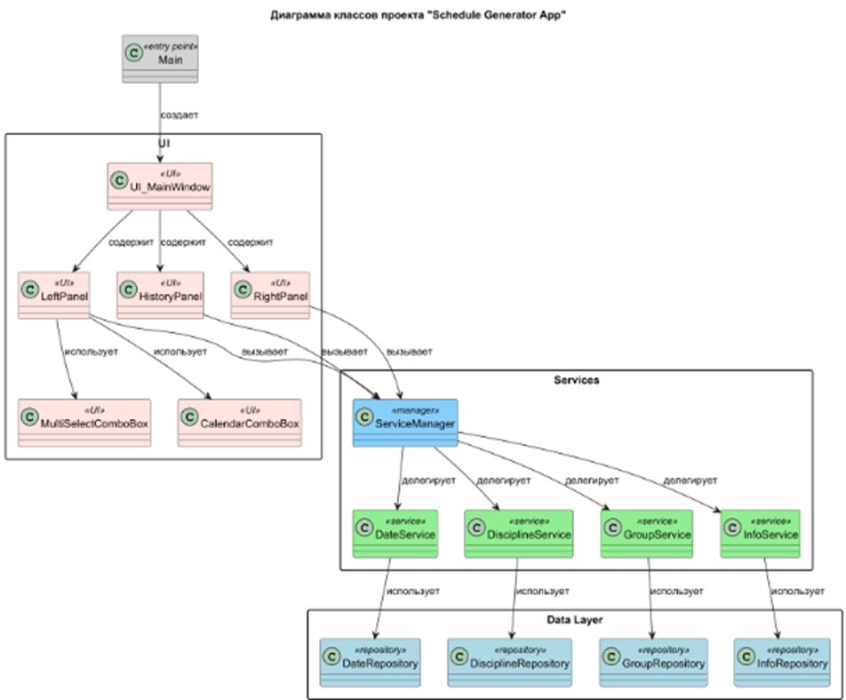
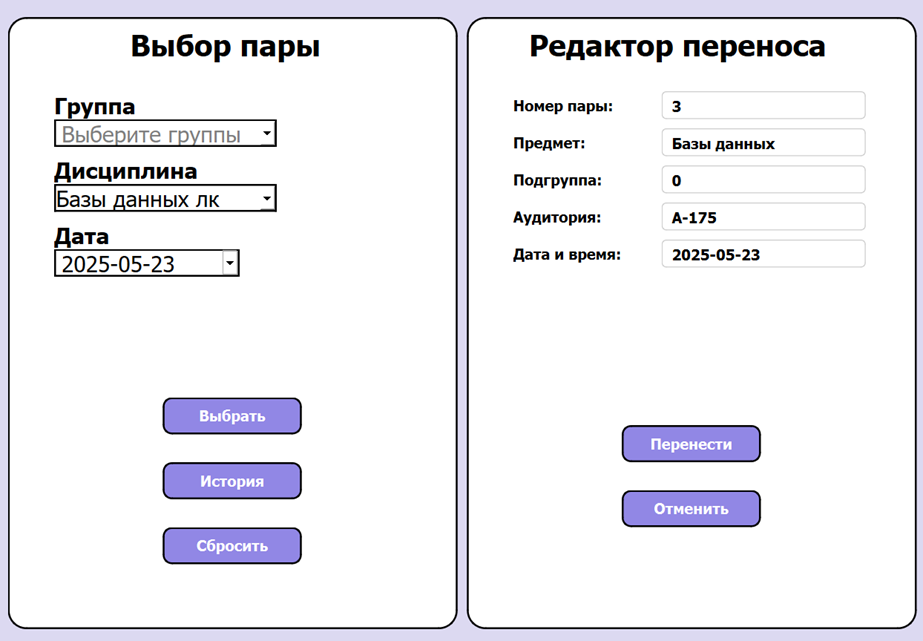
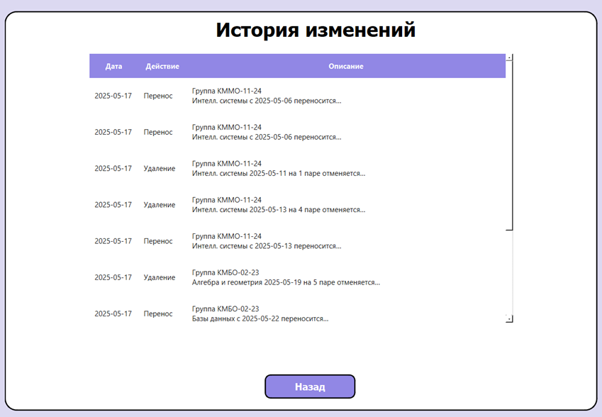

# Приложение для изменения расписания

Данный проект — курсовая работа по предмету **"Прикладное программирование"**.  
Это приложение предназначено для удобного управления расписанием, позволяя пользователям:

- Переносить пары на другое время или дату  
- Удалять пары из расписания  
- Просматривать историю изменений расписания

---

## Основные возможности

- **Перенос пары:** изменение времени и/или даты пары
    
- **Удаление пары:** удаление занятия из расписания
    
- **История изменений:** просмотр всех изменений, которые были сделаны в расписании

---

## Технические детали

- Язык: Python 3.10  
- Используемые библиотеки: PyQt6, PostgreSQL
- Формат данных: PostgreSQL база данных  

---

## Установка и запуск

1. Склонируйте репозиторий:
    
    ```bash
    git clone <https://github.com/BiGiPiG/ScheduleGeneratorApp.git>
    ```

2. Установите необходимые зависимости
    
   ```bash
    cd ./ScheduleGeneratorApp
    pip install -r requirements.txt
    ```

3. Запустите приложение

   ```bash
    python ./src/main.py
    ```
---

## Архитектура проекта



## Использование


- Для переноса пары выберите нужную пару и укажите новое время/дату.

- Для удаления пары выберите её и нажмите кнопку удаления.
    
- Для просмотра истории изменений откройте соответствующий раздел.



